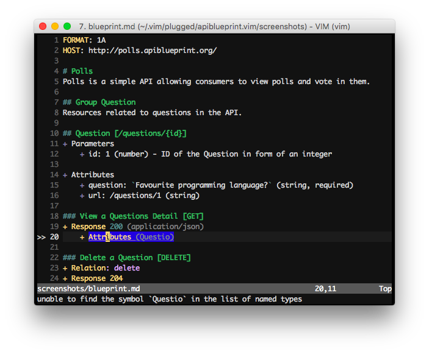

# apiblueprint.vim

This vim plugin brings syntax highlighting and linting for [API
Blueprint](http://apiblueprint.org).



## Usage

The plugin adds an `apiblueprint` file type along with an `apiblueprint`
syntax.

### Linting

Using [syntastic](https://github.com/scrooloose/syntastic), your API Blueprint
can be linted on each save. For this, you will need to install both
[drafter](https://github.com/apiaryio/drafter#install) and
[syntastic](https://github.com/scrooloose/syntastic#2-installation).

### Apiary

You can use the [apiary client](https://github.com/apiaryio/apiary-client) with
this plugin to load a blueprint from Apiary directly providing apiary client is
installed and configured.

```shell
$ vim apiary:pollsapi
```

### Refract

Providing you have [drafter](https://github.com/apiaryio/drafter#install)
installed. You can use `ctrl` + `b` to generate a preview of the Refract
structure for your API Blueprint in a split.


## Installation

### With [vim-plug](https://github.com/junegunn/vim-plug) (recommended)

Add:

```viml
Plug 'kylef/apiblueprint.vim'
```

To your `.vimrc` and run `PlugInstall` inside vim.

### With [Vundle](https://github.com/gmarik/vundle)

Add:

```viml
Plugin 'kylef/apiblueprint.vim'
```

To your `.vimrc` and run `PluginInstall` from within vim or `vim
+PluginInstall +qall` from the command line

### With [Pathogen](https://github.com/tpope/vim-pathogen)

```shell
$ git clone https://github.com/kylef/apiblueprint.vim.git ~/.vim/bundle/apiblueprint.vim
```
