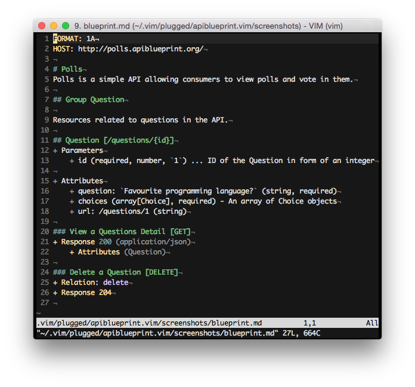
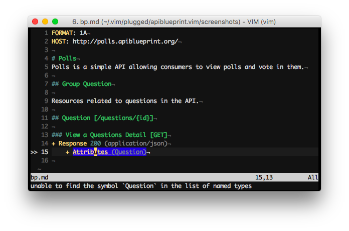

apiblueprint.vim
================

This vim plugin brings syntax highlighting and linting for [API
Blueprint](http://apiblueprint.org).



## Usage

The plugin adds an `apiblueprint` file type along with an `apiblueprint`
syntax.

### Apiary

You can use the [apiary client](https://github.com/apiaryio/apiary-client) with
this plugin to load a blueprint from Apiary directly providing apiary client is
installed and configured.

```shell
$ vim apiary:pollsapi
```

## Installation

### With [vim-plug](https://github.com/junegunn/vim-plug)

Add:

```viml
Plug 'kylef/apiblueprint.vim'
```

To your `.vimrc` and run `PlugInstall` inside vim.

### With [Vundle](https://github.com/gmarik/vundle)

Add:

```viml
Plugin 'kylef/apiblueprint.vim'
```

To your `.vimrc` and run `PluginInstall` from within vim or `vim
+PluginInstall +qall` from the command line

### With [Pathogen](https://github.com/tpope/vim-pathogen)

```shell
$ cd ~/.vim/bundle
$ git clone https://github.com/kylef/apiblueprint.vim.git
```

## Linting

Using [syntastic](https://github.com/scrooloose/syntastic), your API Blueprint
can be linted on each save.



### Installation

- Install [drafter](https://github.com/apiaryio/drafter#install)
- Install [syntastic](https://github.com/scrooloose/syntastic#2-installation)
    Note: You can install this the same way you installed the API Blueprint
    plugin.

